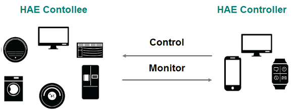
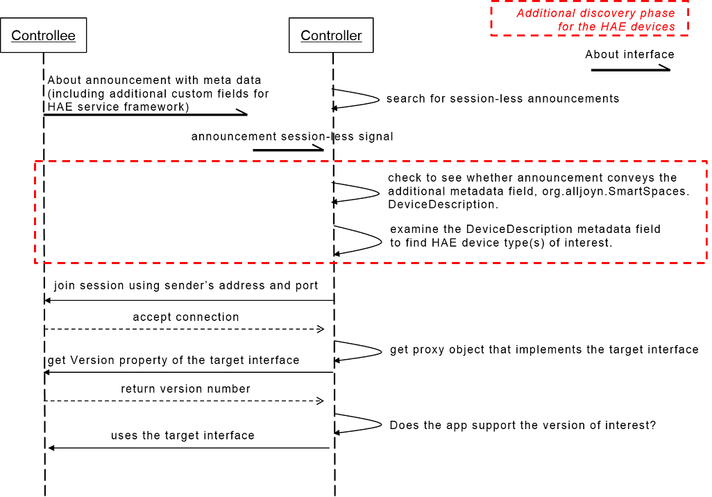

## Theory of Operation
This document describes the theory of operation how the Home Appliances and
Entertainment Service Framework should work. It contains the device model,
semantic relationship between interfaces and the standard device types for the
HAE Service Framework.

### Overview

The goal of the HAE Service Framework is to standardize AllJoyn interfaces for
Home Appliances & Entertainment(HAE) category devices and provide common open
source implementation.

#### Benefits

##### Cross-vendor interoperability

The standardization of AllJoyn interfaces for home appliances and entertainment
devices is mightily important to establish the cross-vendor interoperability.
These standard interfaces will enable to control and monitor devices from
different vendors by using a controller application or device from another
vendor. Such standard interfaces define common functionalities among devices
under the same categories by each vendor. This approach provides common
interfaces and functionalities to developers but also the same user experiences
to end-users. It will guarantee the interoperability of controller application
for each vendor.

##### Background Control & Monitoring

AllJoyn provides the control panel service framework to control devices, but it
requires human's interpretation and interaction from the controller side to
control devices. To support various automation services for IoT, background
control and monitoring should be enabled. Users do not need to see and touch
their mobile or smart watch. Voice or text based control and monitoring will
be enabled. Even machine to machine control and interaction can be possible by
using these predefined standard interfaces.

##### Tailor-made UI for each controller screen

Using the control panel might be unsuitable for smart watch or non-screen
devices. With a single control panel UI data, it is not easy to satisfy all the
various screen sizes and shapes of the controller devices such as smart watch,
phone, tablet and TV. The HAE Service Framework is targeted to provide
predefined device functionalities so that controller application developers can
deliver tailor-made UI targeted for each controller screen to end-users.

#### Use Cases

The HAE Service Framework has two types of use cases such as monitoring and
controlling. A HAE controller monitors the current operational status of the HAE
controllee and the controller is warned about interested situation of the HAE
controllee. The HAE controller interacts with one or more HAE controllees to
control their operations. Figure 1 illustrates the usecases between the HAE
controllee and the HAE controller.

Figure 1: Usecases of controlling and monitoring

#### Overall Architecture

The Controllee App works on the HAE devices such as a refrigerator, an air
conditioner or a clothes washer. The Controller App is an application software
that runs on the user’s terminal such as a smart phone or a tablet, and
communicates with a HAE controllee through the AllJoyn bus. The HAE Service
Framework must be implemented by an application on a controllee and the
Controller App must be implemented using the Controller API of the HAE Service
Framework. Figure 2 illustrates the relationship between a controllee app and
controller app.

Figure 2: HAE service framework architecture within the AllJoyn framework

### Device Model
AllJoyn representation of HAE device model follows the AllJoyn bus object
structure and for that, 3 categories of interfaces are defined. AllJoyn bus
object structure carries both the hierarchy and the capability information.
In the HAE Service Framework, this hierarchy reveals the relationship between
a device and children devices. Figure 3 illustrates the general device model
for HAE devices.

Figure 3: HAE device model

#### Categories of interfaces

##### Common Interface
The Common Interface is a common AllJoyn interface for all HAE devices. The name
of common interface is fixed as "org.alljoyn.SmartSpaces.Common". Per About
announcement, there shall be one and only one common interface for HAE
service framework and the bus object where the common interface resides
is the root HAE bus object.

##### Shared Interface
The Shared Interface is sharable or reusable interface by HAE devices. Minimum
mandatory requirements on the shared interfaces to have shall be specified for
each HAE device type.

##### Device Interface
The name of the device interface indicates the HAE device type. Under a root bus
object, there shall be one and only one device interface. Each standard HAE
device type shall have one and only one device interface. The root HAE bus
object might have children bus objects, and some of its children bus objects
might have another device interface to represent its sub-units. But, in any
case, at most one device interface shall be allowed for any given bus object and
children of children device shall be prohibited. In order to comprise of two
or more HAE standard devices as same level under the root bus object, the
container device interface is provided. Use of the container device interface
for just one sub-unit shall be prohibited. The name of device interface shall
start with "org.alljoyn.SmartSpaces.Devices". Each device interface has minimum
mandatory requirements on shared interfaces. "Theory of Operation" section
of each device interface definition describes the list of minimum required shared
interfaces. Table below shows the standard device types for the HAE Service
Framework.

| Device Type | Description                                        |
|-------------|----------------------------------------------------|
|Container|Container device that can be a container including two or more standard devices interfaces.|
|Refrigerator|Device that stores food at temperatures which are a few degrees above the freezing point of water.|
|Freezer|Device that stores food at temperatures which are a few degrees below the freezing point of water (typically about -18 °C), so the food itself is safe indefinitely.|
|Ice Maker|Device that makes ice. It exists as a sub-unit inside a refrigerator container or as a standalone-device.|
|Air Conditioner|Device that alters the properties of air (primarily temperature and humidity) to more comfortable conditions|
|Humidifier|Device that increases air humidity (moisture) in a single room or an entire building.|
|Dehumidifier|Device that decreases air humidity (moisture) in a single room or an entire building.|
|Air Purifier|Device that has a filter that removes dust from the air.|
|Electric Fan|Traditional style fan usually with blades visible from outside.|
|Air Quality Monitor|Device that checks and reports the air quality.|
|Thermostat|Control unit that senses the temperature of a system so that the system's temperature is maintained near a desired set point. The thermostat does this by switching heating or cooling devices on or off or regulating the flow of a heat transfer fluid as needed to maintain the correct temperature.|
|Clothes Washer|Device that washes laundry such as clothing and sheets|
|Clothes Dryer|Device that removes moisture from a load of clothing and other textiles usually shortly after they are washed in a washer.|
|Clothes Washer-Dryer|Device that executes the operations of both a washer and a dryer in a single cavity.|
|Dish Washer|Device that clean dishes and eating utensils.|
|Oven|Device that roasts and heats food in a complete stove|
|Robot Cleaner|An autonomous robotic vacuum cleaner that has intelligent programming and a limited vacuum cleaning system|
|Television|Television set with integrated capabilities that offers more advanced computing ability and connectivity.|
|Cooker Hood|Home appliance that usually hangs above the stove or cooktop and it is used to removes airborne grease, combustion products, fumes, smoke, odours, heat, and steam from the air by evacuation of the air and filtration|
|Cooktop|Home appliance with a flat framework used to place pots to be heated so the food inside is cooked|
|SetTopBox|Home appliance can receive audio and visual contents such as broadcasting program and network streaming and convert them for showing on a display device such as TV. |

#### Device hierarchy and capability

AllJoyn bus object structure carries both the hierarchy and the capability
information. A controller can find device hierarchy and capabilities in the
discovery phase via an About announcement which conveys the bus object
description. Device interfaces reveal the hierarchical relationship between
the root and its children devices. Along with the device interfaces, the
shared interfaces provide the device capability information.
Figure 4 illustrates an example AllJoyn representation for a refrigerator.

Figure 4: Device model for complex

A complex refrigerator consists of three children devices: Freezer, Refrigerator
and Ice Maker. The container device interface can be used to represent a complex
refrigerator like Figure 4. The complex refrigerator allows to change its target
temperature and display the current temperature for its freezer and
refrigerator respectively. In addition to that, it has an additional
capability of ice making and this capability can be independently controlled.

##### Semantic relationship

Hierarchical relationship between bus objects/interfaces will be translated into
their semantic relationship. The same temperature related interfaces can be
shared between the Freezer and the Refrigerator. The semantic meaning of those
two temperatures can be identified by the name of a device interface to which
they belong.

### Discovery

HAE devices are discovered via an AllJoyn About announcement. Each HAE device
uses the About feature to announce basic device information like device
name, manufacturer and model name. In the additional discovery phase, a
controller can recognize hierarchy and capabilities of the HAE device via list
of object paths and interface names. For example, if object descriptions include
refrigerator device interface, a controller can be aware of  this device as a
refrigerator. Also a controller can get more detailed device information such as
corporate brand and product brand via common interface of the HAE Service
Framework in this phase.

#### Discovery call flow
Figure 5 illustrates a call flow for a HAE device.

Figure 5: Discovery call flow

